专利技术交底书
交底书一：数字孪生系统中模型链路权限的资格审判方法及装置
1. 发明名称
数字孪生系统中模型链路权限的资格审判方法及装置

2. 技术领域
本发明属于工业数字孪生、工业人工智能安全治理技术领域，具体涉及一种对数字孪生系统中的多个动力学模型进行链路权限资格审判的方法和装置。

3. 背景技术
在工业数字孪生系统中，通常会部署多个数据驱动或物理约束的预测模型、诊断模型和控制模型。这些模型在不同工况下的表现和可靠性不同，简单地将模型划分为"上线"和"下线"两种二元状态，无法满足复杂工业场景对安全性和可用性的同时要求。例如，一个模型在常规工况下预测精度很高，但在分布外工况下可能产生物理上不可能的预测；或者一个模型适合做短期预测，但不适合直接参与闭环控制。业界缺乏一种细粒度的、动态的模型权限管理方法，能够在运行时根据当前的系统状态和约束对每个模型进行资格判定，并分配对应的链路权限（如仅允许预测、允许诊断、允许控制等）。

另外，随着欧盟人工智能法案（EU AI Act）和ISO/IEC 42001等标准对高风险AI系统提出可解释性、可审计和约束执行的要求，企业需要一种可审计的方法来证明AI模型在部署期间始终处于合规和受控状态。但现有技术无法提供模型级别的持续资格监控和权限执行。

4. 发明内容
本发明提供一种数字孪生系统中模型链路权限的资格审判方法，包括：

步骤S1：定义多级链路权限体系。将数字孪生系统对外的链路划分为至少四个权限等级：生产预测（允许输出预测结果）、生产诊断（允许输出诊断信息）、生产控制（允许输出控制指令）、仅诊断（仅用于异常检测不参与控制）、影子（后台运行不对外输出）、离线沙盒（仅用于新模型探索和验证）、物理探测（允许进行主动测试）、拒绝（任何链路均禁止输出）。不同权限等级对应不同的风险和控制要求。

步骤S2：获取当前系统状态快照。快照包括状态语义定义（变量名称、物理含义、单位、范围）、当前约束状态（哪些约束卡片处于激活、挂起、失败状态）、所需观测的可用性、安全边界值。

步骤S3：对请求权限的模型执行硬门槛（HardGate）检验。硬门槛包括以下至少五个检验项的组合：

状态语义兼容检验：验证模型的输入输出变量定义与当前数字孪生系统定义的变量语义是否一致；

约束适用域匹配检验：判断当前系统状态是否位于该模型所绑定的约束卡片声明的适用域内；

所需观测齐备检验：验证执行约束验证所必需的传感器或观测值当前是否在线且精度达标；

安全边界前置检验：使用该模型进行预测时，考虑其不确定性传播后的最坏情况是否越过预先定义的安全状态边界或控制边界；

任务类型允许检验：若请求的权限包括自主控制（autonomous control），判断模型是否持有有效的稳定性或安全证书；若无，则将该权限降级。

步骤S4：对通过硬门槛的模型执行风险门槛（RiskGate）检验。该检验根据以下因素将模型权限进一步细化为采用、降权、仅诊断或仅影子：

模型当前的不确定性校准状态（是否持有有效的不确定性证书及其覆盖域是否包含当前状态）；

当前状态在模型训练分布外的程度（OOD程度）；

基于当前观测可区分模型错误和真实系统变化的置信度（可辨识性）；

模型近期在验证基准集上的历史失效率；

若涉及控制权限，评估在不确定性下采用该模型的最坏情况控制风险上界。

步骤S5：生成资格判决结果。对每个申请的链路权限类型，输出以下之一：授予（granted）、降权（degraded）、拒绝（denied）。若授予，可以附带有效期、权限条件；若降权，给出降权理由和保留的权限；若拒绝，给出拒绝原因。

步骤S6：将资格判决结果写入数字孪生对象（TwinObject）的模型治理状态中，并在后续的决策或控制输出时，依据当前有效的权限决定该模型的输出能否释放到对应链路。

进一步地，本发明还提供一种实现上述方法的装置，包括：

链路权限定义模块；

系统状态快照获取模块；

硬门槛检验引擎；

风险门槛检验引擎；

资格判决输出与执行模块；

与数字孪生对象的交互接口。

本发明关键点：将传统的模型"部署/不部署"二元决策扩展为多级链路权限矩阵，并通过基于约束和不确定性的两阶段检验（HardGate + RiskGate）在运行时动态确定模型允许输出的链路层级。这使得在模型自身无法准确感知其适用域时，由独立的资格审判机制代为决策，极大提升了工业数字孪生系统的安全性和可用性。

5. 附图

**图1：多级链路权限体系**

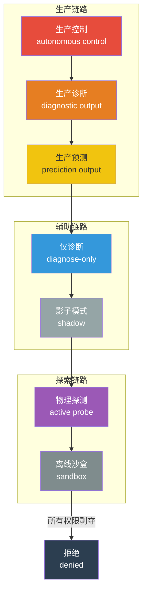

**图2：资格审判方法整体流程（S1-S6）**

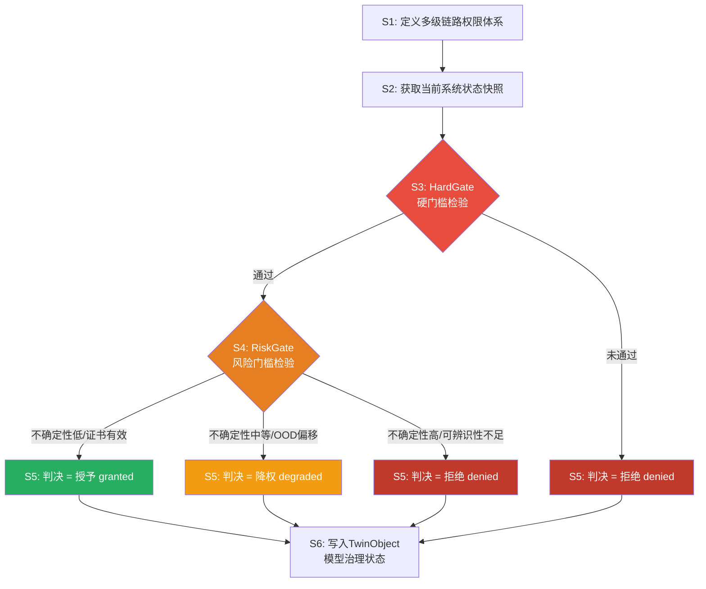

**图3：HardGate 硬门槛检验子步骤**

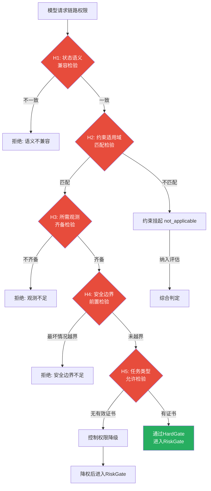

**图4：RiskGate 风险门槛 — 不确定性证书与OOD评估交互逻辑**

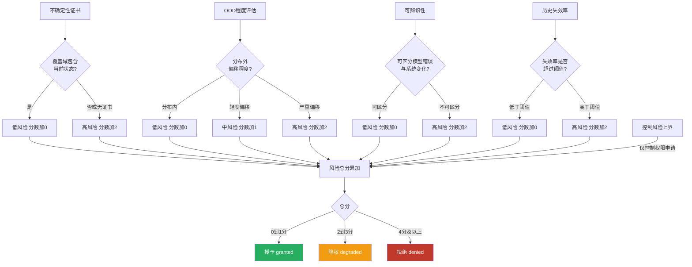

**图5：资格审判装置模块结构图**

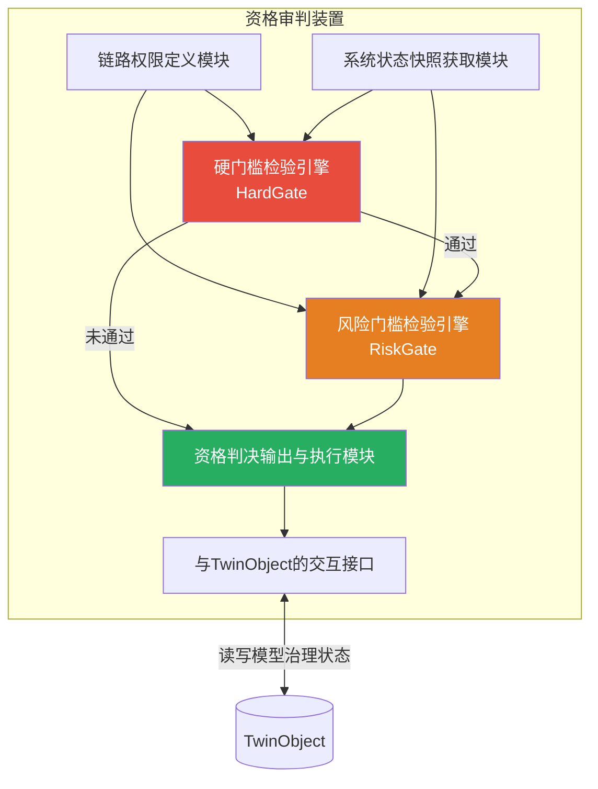

6. 具体实施方式
6.1 实施例一：四足机器人模型权限管理
在四足机器人仿真与真实场景迁移中，部署了多个模型：一个基于Koopman算子的线性预测模型A，一个基于傅里叶神经算子(FNO)的接触力场预测模型B。系统定义链路权限。初始时，模型A在硬化地面已验证，通过硬门槛和风险门槛，被授予生产预测、生产诊断和影子权限，但不能用于生产控制（因缺乏长期接触稳定性证书）。模型B在软沙地形经过校准，被授予生产预测、生产诊断、诊断和生产控制权限（因其接触力预测在多种地形验证通过）。

当机器人从硬化地面走入软沙时，系统状态快照改变。硬门槛检测到模型A的约束适用域（硬化地面接触模型约束）不匹配当前状态，标记其约束为not_applicable（挂起）。同时安全边界前置检验显示模型A在沙地上的不确定性导致最坏情况越界。因此，模型A的生产控制权限申请被直接拒绝；它的生产预测和诊断权限被降级为诊断和影子（只允许后台比较，不用于控制）。模型B的约束适用域匹配，且持有该地形的有效不确定性证书，因此保留其全部权限。资格判决结果写入TwinObject，Bridge随后生成行动空间时，会禁止使用模型A的任何输出进行控制，并提示操作员当前控制可信任模型B。

6.2 实施例二：化工反应器模型在催化剂失活时的权限迁移
反应器部署了数据驱动的温度预测模型C和基于物理守恒的平衡模型D。在正常运行时，模型C精度高，被授予生产预测权限。当催化剂活性监测显示不在模型C的训练分布内，HardGate中的OOD程度检测和约束适用域匹配检测标记模型C不符合。模型C的生产预测权限被降级为诊断（仅用于对比分析），转而采用保守物理模型D进行生产预测。同时，由于模型D没有优化控制能力，生产控制权限请求被拒绝，触发安全回落策略。整个过程被完整审计，符合可解释AI法规要求。

6.3 实施例三：扩展的风险门槛——干预有效性审查
对于申请生产控制权限的模型，在风险门槛中增加一项干预有效性审查：检查模型是否在包含控制动作变化的数据上训练或验证过，是否能区分相关与因果。如果模型只有被动观测拟合能力而无干预反事实证据，则即使在硬门槛通过的情况下，控制权限也被降级为诊断或影子。

通过上述具体实施方式可以理解，本发明通过细粒度的链路权限体系和两阶段检验，实现了数字孪生系统中模型应用安全性和可用性的解耦和自动化治理。

交底书二：基于约束状态与知识边界的行动空间生成方法及装置
1. 发明名称
基于约束状态与知识边界的行动空间生成方法及装置

2. 技术领域
本发明属于人机交互决策支持技术领域，具体涉及一种在约束治理的数字孪生系统中，为人类操作员动态生成结构化行动空间的方法和装置。

3. 背景技术
当前工业控制系统和数字孪生平台通常为操作员提供原始数据和报警，或者给出单一的优化建议。在高度不确定的工况下——例如系统正在退化、模型失效或安全边界受到威胁——人类操作员需要知道他们可以安全地做什么、不能做什么，以及有条件可以做什么。然而，现有系统无法将模型的可信度、约束违反状态、知识边界和探索引擎发现的证据整合成一个结构化的行动选项清单。这导致操作员在紧急情况下信息过载，或者只能凭经验做出可能违反安全约束的决策。

欧盟人工智能法案和工业安全标准日益要求高风险AI系统提供"人类监督"和"可审计的人工干预记录"。但缺乏一种系统化的方法将机器判决（例如"此时模型不可信"）转化为人类可以执行或审批的可操作步骤。

4. 发明内容
本发明提供一种基于约束状态与知识边界的行动空间生成方法，包括：

步骤S1：接收系统状态快照。该快照包含：数字孪生对象的身份状态（正常/身份不确定/退化/冻结）、模型治理状态摘要（当前生产链路模型及其权限、退化模型）、有效约束的违反或挂起状态、已知的知识边界（已知域、不确定域、未知域）、由隔离探索引擎提交并经过治理核准入的候选证据（约束假设、负面结果、主动探测提案）。

步骤S2：加载场景行动模板。行动模板为领域专家预定义的可能动作集合，每个动作标注：动作类型（观测增强、参数调整、切换模型、启动诊断、申请审查、安全保持、紧急停机等）、执行条件、监护需求、所需审批角色。

步骤S3：根据快照中的约束状态、模型权限、知识边界，将行动模板中的每个动作映射为四类行动空间之一：

可立即执行的动作：动作的所有前提均已满足（Core允许，约束通过，证书有效），分配给经授权的操作员，并附风险等级（低/中/高）、残余不确定性、执行前是否需要一次新鲜的Core状态确认；

有条件执行的动作：动作的前提未完全满足，列出未满足项及合法解锁路径（所需证据、审查、证书、角色审批），并禁止描述任何绕过Core安全判决的路径；

禁止执行的动作：动作已被Core的安全关键约束或资格审判明确拒绝，说明永久或条件性禁止原因及解锁条件（若有），并标注违反风险；

当前不可判定的动作：由于知识状态不足无法分类的动作，说明需要何种信息才能做出判定。

步骤S4：生成行动空间输出。该输出为结构化数据，包含步骤S3分类的动作列表，同时附加：

有效期声明：生成时所基于的快照标识、建议的有效期截止时间、以及导致输出立即失效的触发器列表（例如约束状态变化、身份状态变化、模型链路权限变化、安全边界变化）；

知识边界声明：明确当前系统已知什么、不确定什么、未知什么、可靠预测的时间范围。

步骤S5：接收人类操作员的选择。在选择时进行以下验证：

所选动作所在行动空间的输出是否仍在有效期内；

所选的执行模式（人直接执行、请求Core执行、仅阅览）与该操作员的角色权限是否匹配；

若动作要求执行前新鲜Core状态确认，则检查该确认是否已完成且确认结果允许执行。

步骤S6：生成不可篡改的决策审计记录。记录包括：呈现的情境快照、所有行动选项、已披露的风险、操作员的选择、风险确认、是否触发例外请求流程等。该记录用于后续合规审计。

进一步地，本发明提供一种实现上述方法的装置，包括：

快照接收模块；

行动模板库；

行动空间分类引擎；

有效期管理模块；

人类交互与验证模块；

审计记录生成模块。

本发明关键点：将传统"AI建议"或"报警列表"升级为基于当前约束和可信度边界的结构化"行动空间"，并且输出具有时效性，迫使任何执行动作前进行状态新鲜验证。这种设计使得人在回路中的决策被限定在可审计的安全边界内，同时为合规提供完整的机器判决-人类选择的证据链。

5. 附图

**图1：行动空间生成方法整体流程（S1-S6）**

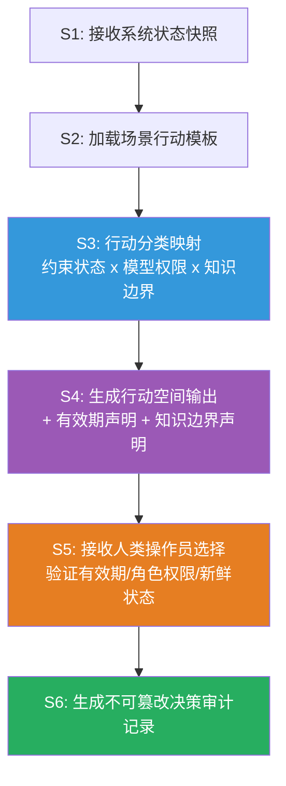

**图2：约束状态/模型权限/知识边界 → 行动分类映射逻辑**

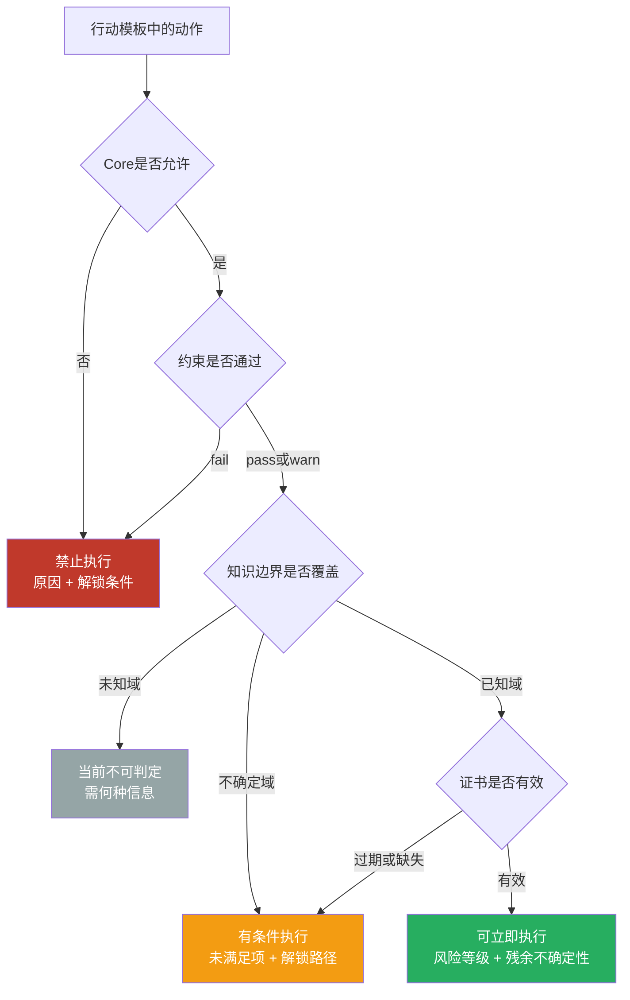

**图3：有效期管理与输出失效触发器状态转移图**

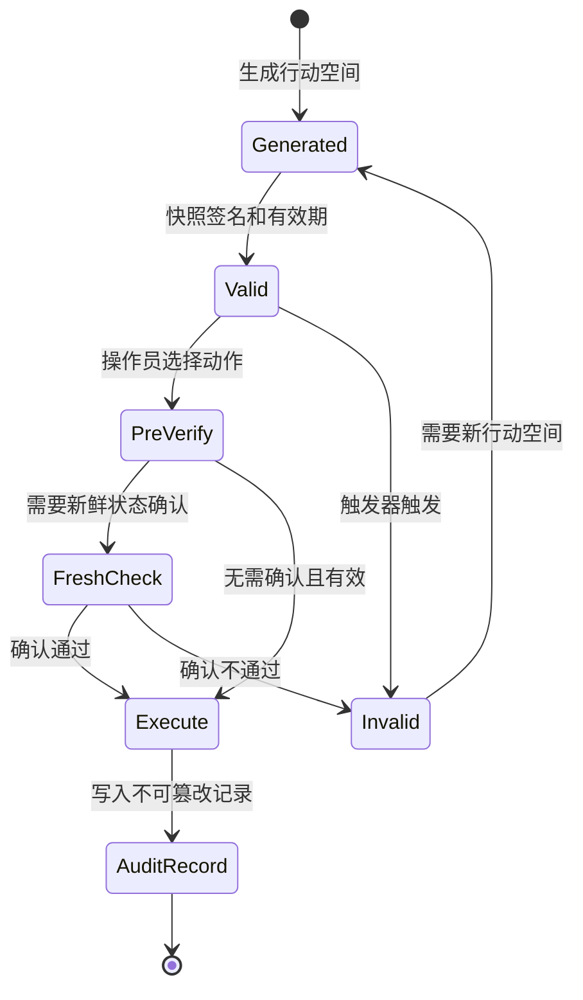

**图4：人类选择审计记录生成数据流**

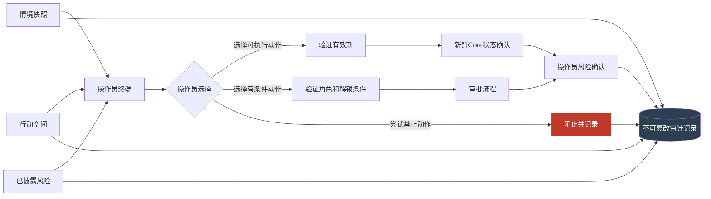

**图5：行动空间生成装置模块结构图**

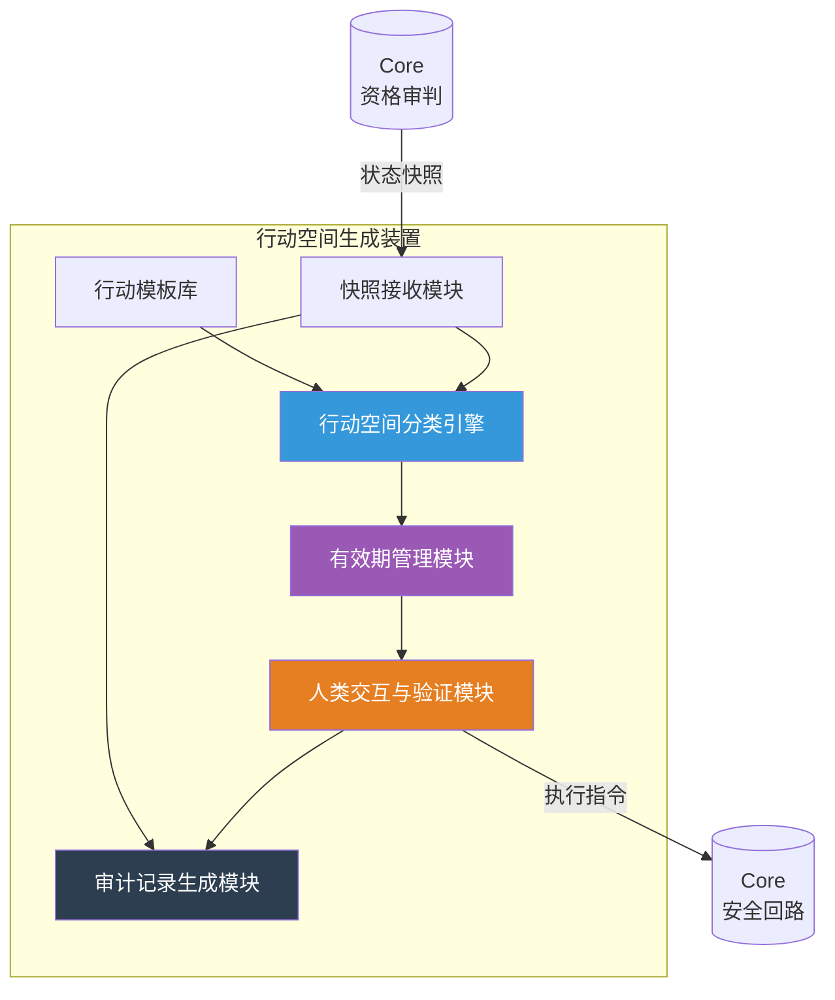

6. 具体实施方式
6.1 实施例一：四足机器人地形突变下的人类决策
机器人从硬地进入未知松软地形后，Core判决定位模型A（Koopman）失效，其控制权限被降级。Bridge接收快照，加载行动模板（包括"切换至安全步态"、"发起主动地形探测"、"暂停自主行走"、"请求模型重新校准"等）。行动空间分类引擎根据快照生成结果：

可立即执行："暂停自主行走，进入安全保持姿态"（前提由Core确认安全回落策略可用，风险低，需要新鲜状态确认）；

有条件执行："发起主动地形探测"——说明其前提是需获得ActiveProbe Certificate，并需高级操作员审批；

禁止执行："使用模型A继续自主行走"——禁止原因：模型A的控制权限已被拒绝，安全边界不足。

不可判定："是否可加速通过该地形"——因当前无模型覆盖该动态行为，信息不足。
操作员终端显示结构化清单而非单条建议。操作员选择"暂停自主行走"，系统验证其角色允许，并执行新鲜Core状态确认后，指令通过Core的安全回路发送。整个过程自动生成决策审计记录，包括操作员未选择的"有条件探测"选项，为后续复盘提供完整依据。

6.2 实施例二：化工厂反应器冷却系统失效下的决策
反应器冷却能力下降被检测，模型C（数据驱动预测）资格被降级，约束卡片"最高温度安全边界"处于fail状态。Bridge行动空间生成：

可立即执行："启动紧急冷却注入"（如果尚属于安全操作且约束允许）、"安全排空预处理"；

禁止执行："继续当前批量生产"（违反温度硬约束）；

有条件执行："反应器切换至回收模式"——需要反应器未处于热失控临界，需要额外传感器确认。
操作员在有效期内做出选择，所有操作均经过新鲜状态确认，审计记录记录了操作员对风险的确认以及对"禁止动作"的知情。

通过上述实施方式，本发明在保证安全约束不被人类绕过的前提下，为操作员提供了透明、有序、可审计的决策支持。

交底书三：数字孪生系统的身份连续性管理方法及装置
1. 发明名称
数字孪生系统的身份连续性管理方法及装置

2. 技术领域
本发明属于工业数字孪生及自适应系统领域，具体涉及一种对数字孪生体所反映的物理系统"身份"变化进行连续监测、区分和分支管理的方法及装置。

3. 背景技术
数字孪生被期望能够随物理系统的变化而自适应更新。但现有技术缺乏区分"系统正常退化"（例如设备老化）和"系统身份发生本质改变"（例如更换核心部件、从正常态进入故障态）的能力。这导致两个风险：一是将重大的身份改变视为模型误差，强行用旧模型拟合新数据，导致预测失准；二是在系统实际只发生微小漂移时过早抛弃已验证的模型，重建新模型，造成知识浪费。

此外，数字孪生的更新过程缺乏历史审计，无法回答"模型为什么被替换"、"新模型是否仍然代表原来的那个系统"。随着资产管理、医疗保健和自主系统的监管要求提高，需要一种正式方法来管理数字孪生"身份"的连续性。

4. 发明内容
本发明提供一种数字孪生系统的身份连续性管理方法，包括：

步骤S1：定义数字孪生对象的身份不变量集合。该集合至少包括：

状态语义定义（变量名称、物理含义、单位、范围）；

安全边界集合（状态和控制的硬上下界）；

绝对约束集合（不可违反的物理守恒律和操作限制）；

验证基准集（一组用于判断模型有效性的标准历史数据集）。

步骤S2：在数字孪生运行期间，持续根据传感器数据评估多个已注册模型的一致性。当观察到模型预测误差系统性增大，或者触发了约束违反事件时，执行可辨识性分析，尝试判断误差源是：

传感器偏差/故障；

模型自身错误（模型漂移）；

物理系统本身发生了退化（对象身份内的合法演化）；

物理系统发生了根本性改变（身份断裂）。

步骤S3：当现有证据不足以区分上述情形时，将数字孪生体设为"身份不确定"状态。在此状态下，系统暂停自动模型更新，维持当前安全控制策略，并主动请求或等待更多信息（例如主动探测、人工检查）。如果可辨识性置信度提升到阈值以上，则退出不确定状态。

步骤S4：当证据充分表明系统仅发生参数退化而未改变其本质身份时（如磨损导致的参数缓慢变化），执行版本更新（version_update）。将更新记录写入身份谱系：包括修改的参数、更新原因、验证基准集上的性能。旧版本保留供回溯。

步骤S5：当证据充分表明系统发生了根本性的、不可逆的身份改变时（如核心部件更换、疾病亚型转变），执行身份分叉（identity_branch）。创建一个新的数字孪生子对象，并从父对象继承未断裂的身份不变量。记录分支事件，包括：哪些不变量被破坏、哪些被继承、子对象新身份的范围。原父对象可选择退役或作为历史参照继续存在。

步骤S6：在数字孪生体经历版本更新或分叉后，重新认证所有已注册模型的资格。模型在新的身份和基准集上重新进行资格审判（如交底书一所述），确保运行在新身份上的模型是经过验证的。

步骤S7：维护一个可追溯、不可篡改的身份谱系（TwinLineage）。该谱系记录所有版本更新、分叉、重建事件，形成数字孪生的"族谱"，从而保证任何时候都能回答"这个模型是基于哪个系统身份训练的"、"该控制决策是基于哪个版本的状态语义做出的"。

进一步地，本发明提供一种实现上述方法的装置，包括：

身份不变量定义模块；

误差源可辨识性分析模块；

身份不确定状态管理模块；

版本更新与分叉执行模块；

资格重新审判触发模块；

身份谱系数据库。

本发明关键点：通过定义不可变和可变的身份不变量，将数字孪生的演化区分为版本升级和身份分叉，并强制在身份改变后重新进行模型资格审判。这为长生命周期工业资产和慢病管理等场景提供了"模型-对象"之间持续一致性的保证，并为合规审计提供了明确的演化历史。

5. 附图

**图1：身份连续性管理方法整体流程（S1-S7）**

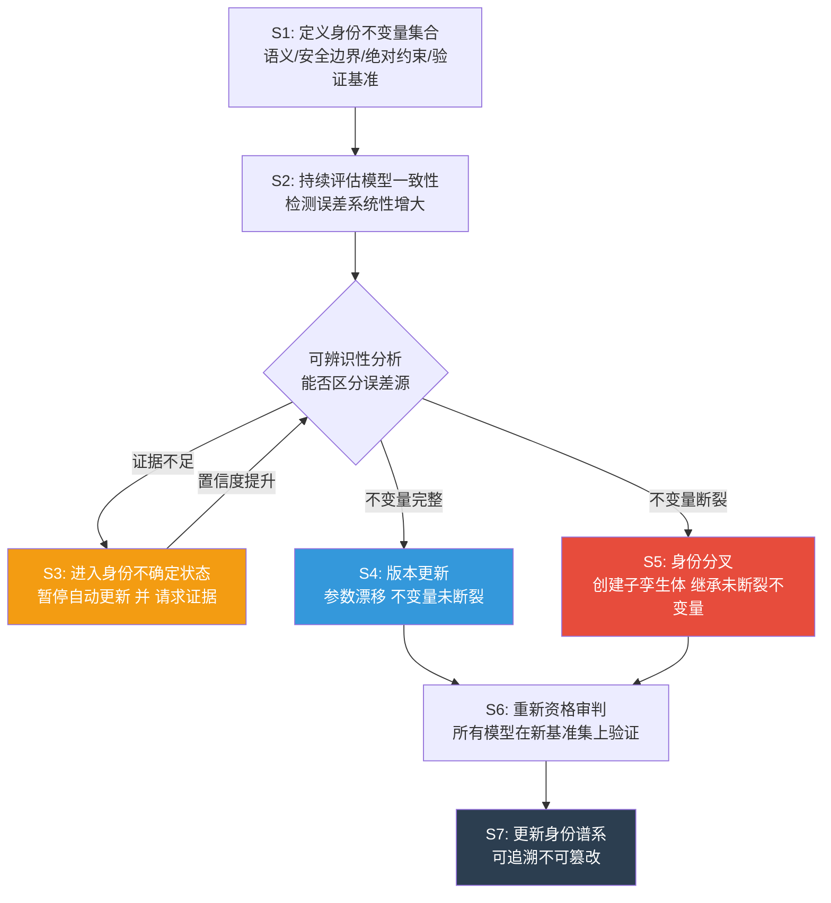

**图2：身份状态转移图**

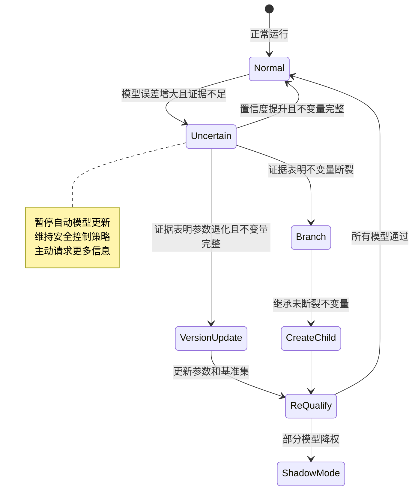

**图3：误差源可辨识性分析决策树**

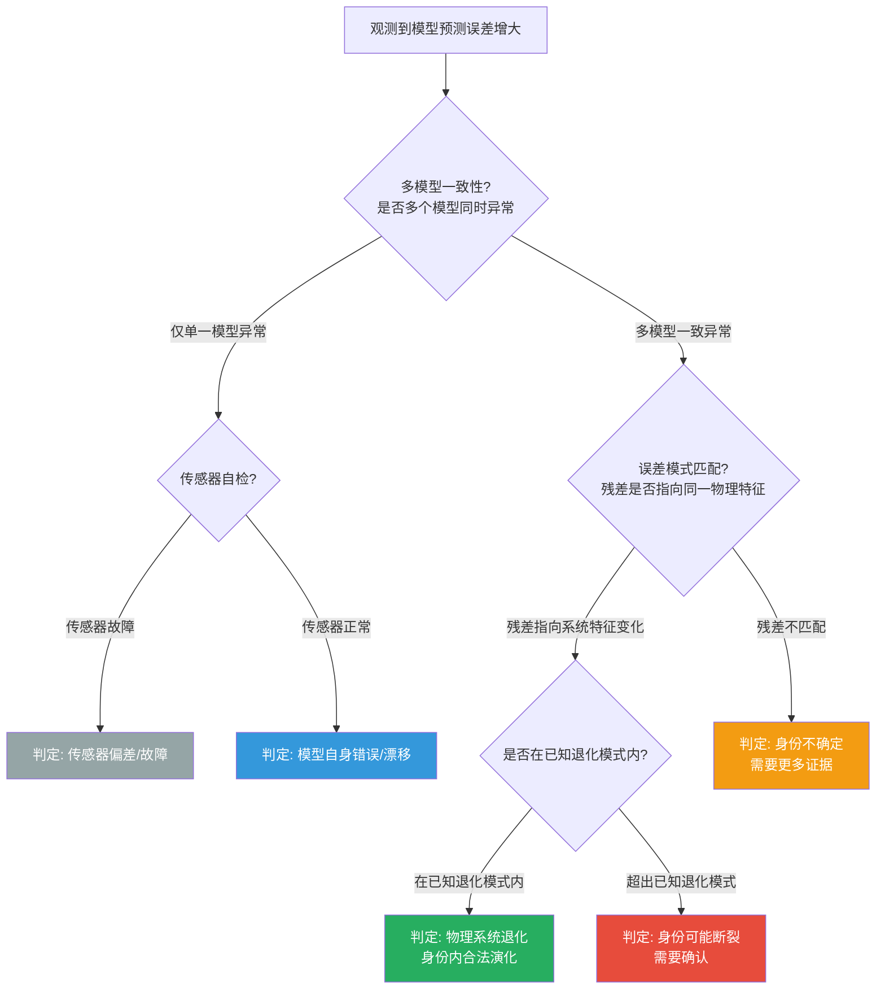

**图4：身份分叉的父子对象关系及不变量继承**

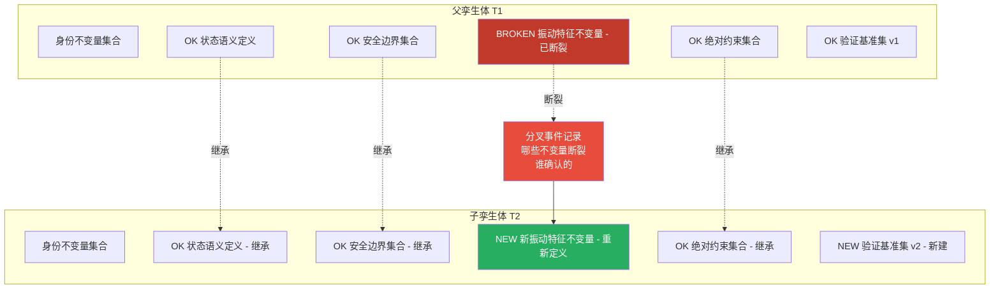

**图5：身份谱系 TwinLineage 逻辑结构**

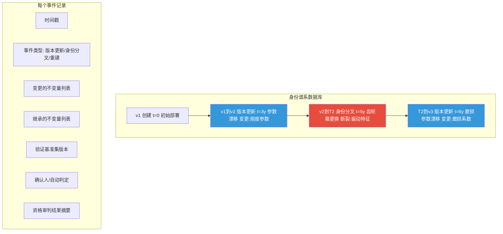

**图6：身份连续性管理装置模块结构图**

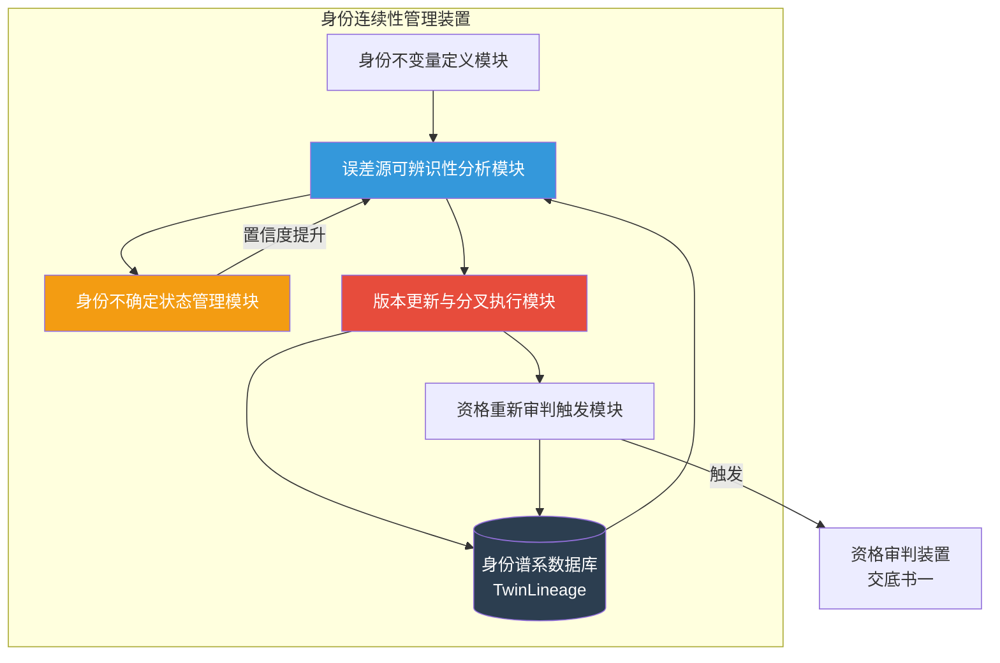

6. 具体实施方式
6.1 实施例一：风电齿轮箱的退化与更换
一个风机的数字孪生体包含齿轮箱振动模型。在运行三年后，模型预测误差开始增大。系统进行可辨识性分析，通过比较多个模型(如振动频谱模型、温度模型)的残差模式，结合传感器自检数据，发现多个模型一致性指向齿轮箱特征频率的变化，而非单个传感器故障。判断为系统退化（身份内变化），执行版本更新：记录齿轮箱刚度参数的变化，更新验证基准集。更新后，模型重新进行资格审判，确认继续可用。该版本的模型即为当前"可信"表征。

又过了两年，齿轮箱因故障被整体更换。更换后传感器数据发生剧烈变化，系统判断发生了身份断裂。执行身份分叉：创建一个新的子孪生体"风机-齿轮箱更换后"，继承原来的发电量约束、安全边界，但打破了旧的振动特征不变量。新孪生体在初始训练后，所有模型重新资格审判，旧孪生体退役用于历史对比。审计人员通过身份谱系清晰看到整个生命周期。

6.2 实施例二：帕金森患者疾病亚型转变
一个帕金森患者的数字孪生体初始基于"震颤为主型"建模。随着时间推移，出现步态冻结症状。模型误差增大。可辨识性分析排除穿戴设备故障。证据表明步态冻结是新的病理表现而非单纯进展，系统判定位身份可能分叉。进入"身份不确定"状态，暂停用药建议模型的自动更新，请求临床评估。临床医师确认患者进入新的亚型阶段。这时系统执行身份分叉：创建新孪生体"步态冻结亚型"，继承历史用药记录和年龄，但打破旧的运动模型参数，采用新的评估基线。资格审判使旧模型在新孪生体中被拒绝，而新的冻结评估模型被准入。整个过程记录了为什么改变、何时改变、谁确认的。

6.3 实施例三：化工厂反应器催化剂失活（身份内演化）
反应器催化剂活性随时间下降。数据连续小幅度漂移，多个模型一致指向转化率缓慢下降，且没有异常传感器报告。系统判断为渐进式退化（身份内演化）。执行自动版本更新，更新催化剂活性参数，重新校准模型。整个过程不需要身份分叉，因为系统身份（反应器配置）没有改变，仅仅是性能参数漂移。这避免了不必要地创建新孪生体并重新训练所有模型。

通过上述实施例可以看出，本发明解决了数字孪生"何时应该更新模型"和"何时应该承认系统已是另一个系统"这一根本难题，实现了安全、渐近且可审计的自适应演化。

---

## 核心权利保护点提炼

三件交底书各有一个不可替代的核心创新点：

### 交底书一核心：运行时两阶段资格审判 × 多级链路权限矩阵

| 传统方案 | 本发明 |
|----------|--------|
| 模型上线/下线，二元判断 | 8级链路权限，细粒度分配 |
| 离线验证后静态部署 | 运行时动态审判，状态变化即重判 |
| 单一门槛或不检验 | HardGate（5项否决性）+ RiskGate（量化降权）两阶段 |

**一句话保护点**：运行时基于约束状态对模型进行两阶段资格审判，动态分配多级链路权限。

**为什么难绕过**：两阶段结构是核心——HardGate做否决性硬检验（不过即拒绝），RiskGate做量化软分级（过但降权）。想绕过必须同时发明这两层逻辑，而不仅仅是"动态权限"这个概念。

---

### 交底书二核心：四类结构化行动空间 + 时效性强制验证

| 传统方案 | 本发明 |
|----------|--------|
| AI输出"你应该做X"（单一建议） | AI输出四类行动空间（可执行/有条件/禁止/不可判定） |
| 建议无时效约束 | 行动空间有有效期 + 失效触发器，执行前必须新鲜状态确认 |
| 操作员可忽略建议 | 禁止动作明确列出，无法绕过Core安全判决 |

**一句话保护点**：基于约束状态生成四类结构化行动空间，附带时效性声明和强制新鲜验证。

**为什么难绕过**："输出选项而非建议"是范式差异。传统AI是"替人决策"，本发明是"限定人的决策空间"。时效性强制验证使得任何执行动作必须经过最新约束确认，构成审计闭环。

---

### 交底书三核心：身份不变量驱动的版本更新 vs 身份分叉二分类

| 传统方案 | 本发明 |
|----------|--------|
| 模型误差大就重训，小就微调 | 定义身份不变量集合，判断不变量是否断裂 |
| 无法区分"退化"和"变了" | 版本更新（不变量完整）vs 身份分叉（不变量断裂）二分类 |
| 无演化历史 | TwinLineage 身份谱系，可追溯不可篡改 |

**一句话保护点**：基于身份不变量的完整性判定孪生体应执行版本更新还是身份分叉。

**为什么难绕过**：身份不变量是核心抽象——不定义"什么不变"，就无法区分"变了什么"。绕过意味着必须发明另一套等价的形式化体系来区分"系统退化"和"系统身份改变"。

---

## 申请策略

### 必须申请：交底书一 + 交底书二（P0）

两件构成 Core→Bridge 完整技术闭环：
- **交底书一**管"模型能不能用"——资格审判决定权限
- **交底书二**管"人能做什么"——行动空间限定决策

缺少任何一件，保护链断裂：
- 只有一没有二：保护了模型权限判定，但人机交互层面无保护，竞品可在Bridge层绕过
- 只有二没有一：保护了行动空间生成，但资格审判层无保护，竞品可用简单权限判定替代HardGate/RiskGate

### 建议申请：交底书三（P1）

锦上添花。学术价值高，长期运行场景必需，但不与一、二构成保护闭环断裂风险。预算允许则申请，不允许可暂缓。

### 提交方式

- 交底书一、二**同日提交**，互不构成现有技术
- 交底书三视预算决定是否同期提交，或间隔1-2月提交
- 优先中国专利，同时提交PCT，指定美国、欧盟、日本
- 正式申请前完成预印本脱敏，防止影响新颖性

---

以上为面向专利团队的核心技术交底书和申请建议。请专利代理师根据这些技术方案撰写正式权利要求书和说明书。